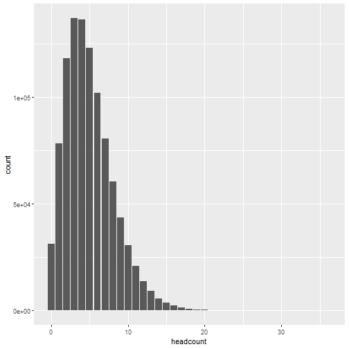
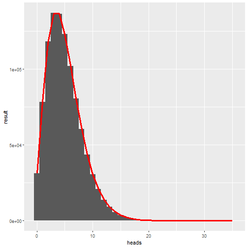

## Introduction

## Parameters and initialisation

Clear the memory of objects stored from previous work and call libraries: 

```r
rm(list=ls())	# Remove objects currently in the workspace 
require(stats)							# Call the stats package for gamma and exponential distributions 
library(tibble)
library(ggplot2)
library(dplyr) 
```

Set the timer: 

```r
tic = Sys.time() 
```

Initiaise parameters:

```r
p  = 0.50							# Probality of heads
nsim  = 1e6							# Number of simulations
kt_target  = 5							# Number of tails when the experiment stops
headcount <- array(dim=c(nsim))					# Initialise an n-array to record when events occur
plot_bins = 200
```


```r
for (isim in 1:nsim) {
kt  = 0 
kh  = 0								# Count for number of heads
	repeat{ 
		event = runif(1,0,1) < p			# Simulate events occurring for each time step using uniform distribution
		if (event == 0) { kh = kh + 1 } else {kt = kt + 1}
		if (kt == kt_target) {break} 
	 	}
headcount[isim] = kh }
heads <- tibble(sim = 1:nsim, headcount = headcount)
```


```r
(histplot <-
ggplot(heads)+geom_bar(aes(headcount)))
```



```r
layout(title="Diamonds")
```

```
## Error in layout(title = "Diamonds"): unused argument (title = "Diamonds")
```


```r
max_head = max(headcount)
count_result <- array(dim=c(max_head))				# Initialise array to bucket simulated waiting times for graphical output 
for (i in 1:max_head) {count_result[i] = sum(headcount==(i-1))}				# Allocate simulated wait times to a bucket 

output <- tibble(heads = 0:(max_head-1),
                 result = count_result,
                 nbinom = nsim*dnbinom(heads,size=kt_target,prob=p),
                 ngeom = nsim*dgeom(heads,prob=p))
ggplot(output)+
  geom_col(aes(heads,result),width=1)+
  geom_line(aes(heads,nbinom),colour="red",size=1.2)+
  if(kt_target==1){
    geom_line(aes(heads,ngeom),colour="blue",size=1.2)}
```



```r
#ggplot_build(histplot)$data[[1]] 
#count_result 
```

	
